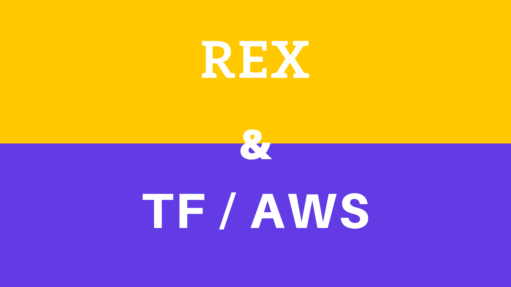

# Retour d'expérience sur la mise en place de Terraform et AWS

Dans le cadre d'un projet, au quel j'ai eu la chance de participer, d'apisation d'un système d'informations, il a été choisi de mettre en place une architecture orientée micro-services sur le cloud d'Amazon Web Services.

Naturellement, Terraform a été la technologie d'IAC (Infrastructure As Code) toute indiquée. Si AWS propose lui même un outil d'AIC, Terraform reste la solution "cloud agnostique" la plus utilisée.

Nous n'avons été accompagné, d'un expert AWS (et non Terraform), qu'après plusieurs mois. Il a donc fallu, en équipe, se plonger dans la documentation, à la fois de Terraform et d'AWS.

En partant de zéro, ou presque, nous avons commencé par faire de nombreux POC (Proof of Concept) de plusieurs services AWS (Lambda, API Gateway ..) afin de comprendre leurs fonctionnement et en saisir leurs particularités. C'était aussi l'occasion, en parallèle, de tester Terraform et donc de monter en compétence sur cette technologie.

Si Terraform possède une grande documentation, celle d'AWS est surement plus longue que les tomes d'Harry Potter mit bout à bout. Le provider propose un catalogue de nombreux services répondant à des problématiques différentes. Il a donc fallu étudier et comprendre ce catalogue afin d'associer le bon outil au bon problème.

Cette période de test a été assez longue, nous avons évolués par tâtonnement, avec la (non-)méthode "d'apprendre sur le tas" qui nous a permi de découvrir rapidement la techno, de la prendre en main, de faire fonctionner un bout de code, mais nous sommes surement passé à côté de certain fondement et/ou principe. Avec le recul et l'expérience il aurait été peut être plus efficient de suivre, pour Terraform tout du moins, les différents cours mis à disposition sur leur site.

Après un temps, et après avoir bien compris le fonctionnement des différentes briques d'AWS et la base de Terraform nous avons pu commencer à produire efficacement. Nous sommes passés de "tester sur l'interface AWS et reproduire sur TF" à "produire en parant de TF". Cependant ça n'a pas été très simple, c'est, je trouve, chronophage que de monter une infrastructure. Effectivement certain services sont assez longs à la création/destruction, il faut parfois patienter longuement pour un simple changement de variable au sein d'une configuration.

Si certaines erreurs peuvent être évitées en utilisant la commande `terraform validate` et/ou `terraform plan` d'autres ne sont, malheuresement, visibles qu'à l'application de la configuration via `terraform apply`.

Il est à noter que, lors d'une application de configuration, si une erreur se produit sur un élément, elle ne remet pas en cause la totalité de l'exécution, concrètement ; ce qui a été créé/détruit/modifié, lors de l'exécution, le reste.

Nous avons rencontrés divers difficultés techniques tels que l'impossibilité de terraformer une DynamoDB depuis un Windows (bug corrigé depuis par Terraform), les 5 à 10 minutes lors de la création ou destruction d'une DocumentDB, lier correctement une API Gateway à une Lambda, lier différents services sur un même VPC, terraformer une APIGATEWAY sur un VPC privé, mettre en place un DNS avec Cloudfront comprenant plusieurs origines.

Si les exemples d'utilisation les plus courants sont illustrés dans les documentations, certaines configuration sont à "découvrir", il faut dans certains cas faire des essais encore et encore, d'où l'aspect chronophage. La documentation, AWS ou Terraform, est cependant très très fouillies et leurs nombre fait que l'on s'y perd très facilement. De plus, ce sont des services qui évoluent régulièrement, il faut donc être à l'écoute des changements et des nouvelles fonctionnalités proposées.

A date, nous avons une infrastructure gérée via Terraform, comportant plusieurs micro-services, sur pas moins de 5 environnements, l'architecture ainsi que les configurations Terraform se révèlent relativement stables et maintenables.

En conclusion, si les ressources mise à dispositions par les éditeurs sont suffisantes pour la grande majorités des cas. La difficulté majeur étant de maîtriser à la fois théoriquement et techniquement le fonctionnement des services AWS et de réussir à implémenter les configurations voulues via Terraform. Monter en compétence sur Terraform en ayant au préalable une expérience d'AWS est certainement bien plus aisé. Personnellement, je pense qu'il manque une diversité de documentation, d'exemples ainsi que des didacticiels "amateurs" proposés via des sites indépendants.